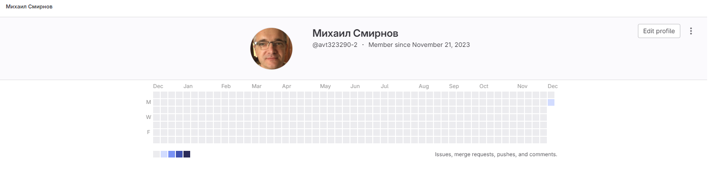
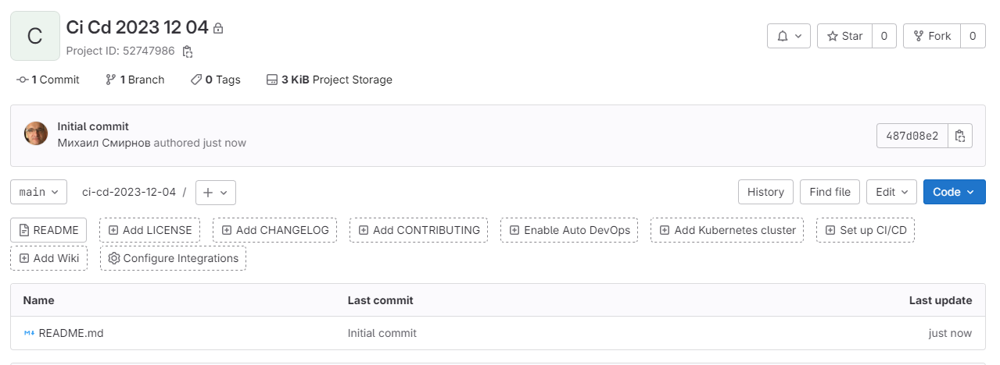
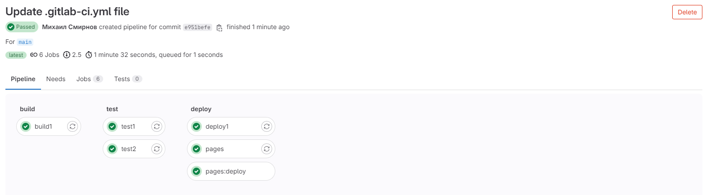
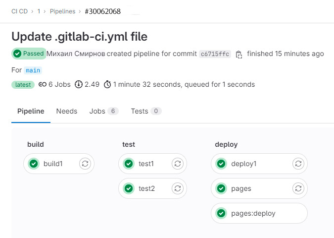
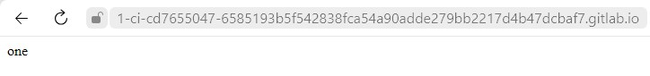
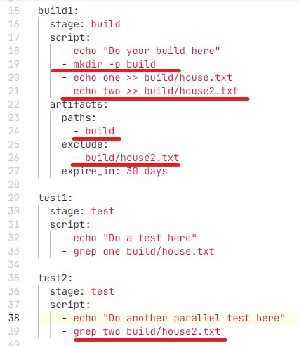
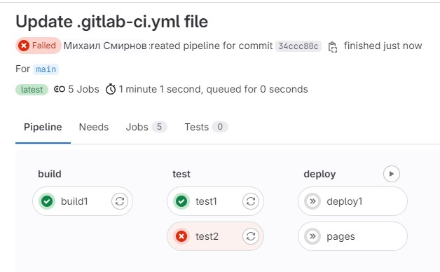

## Домашнее задание к Уроку 1 "Основы CI/CD. Знакомство с gitlab".
### 1. Зарегистрировался в gitlab.com

### 2. Создал проект 

### 3. Создал пайплайн
stages:
- build
- test
- deploy

before_script:
- echo "Before script section"
- echo "For example you might run an update here or install a build dependency"
- echo "Or perhaps you might print out some debugging details"

after_script:
- echo "After script section"
- echo "For example you might do some cleanup here"

build1:
stage: build
script:
- echo "Do your build here"
- echo one >> house.txt
artifacts:
paths:
- house.txt
expire_in: 30 days

test1:
stage: test
script:
- echo "Do a test here"
- echo "For example run a test suite"
- grep one house.txt

test2:
stage: test
script:
- echo "Do another parallel test here"
- echo "For example run a lint test"

deploy1:
stage: deploy
script:
- echo "Do your deploy here"
environment: production

pages:
stage: deploy
script:
- mkdir -p public
- cp house.txt public/index.html
artifacts:
paths:
- public
only:
- main
### 4. Далее, протестировал работу пайплайна на shared раннерах

### 5. Успешно протестировал работу пайплайна на собственном раннере.

### 6. В пайплайне создаётся страничка index.html с текстом one.

### 7. Добавил папку в артефакты и исключил из неё один файл.

### 8. Задание test2 не проходит, т.к. в нём задействуется этот второй файл
