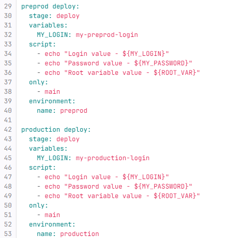
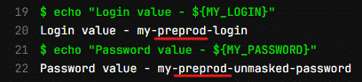
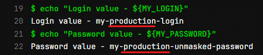
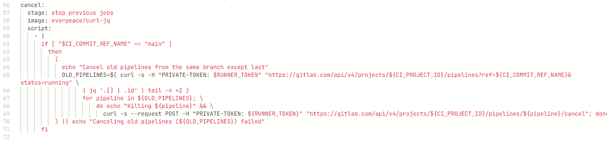

# Домашнее задание по Уроку 3 Continuous delivery и continuous deployment (непрерывная доставка и развертывание)
Ссылка на gitlab_ci.yaml: https://gitlab.com/my_first_project7991847/Ci-Cd-2023/-/blob/main/.gitlab-ci.yml
___
## 1 задание:
1. Добавить 2 окружения "preprod" и "production".
2. Добавить отдельные deploy job для каждой среды.
3. Добавить переменную "$MyLogin" внутри .gitlab-ci.yml, которая будет меняться в зависимости от среды.
4. Добавить переменную "$MyPassword" не используя .gitlab-ci.yml, которая так же будет меняться в зависимости от среды.

### _**Решение к заданию 1**_

Создал две джобы для стадии deploy - preprod deploy и production deploy.

В обеих джобах создал переменную MY_LOGIN с разными значениями.

В настройках гитлаба (Настройки -> CI/CD -> Variables) создал две переменные MY_PASSWORD под разные среды - preprod и production. С разными значениями. Не стал маскировать, чтобы проверить, что в разных средах будут разные значения.

Результат выполнения джобы preprod deploy:

Результат выполнения джобы production deploy:

## 2 Задание
Добавить скрипт в .gitlab-ci.yml, который найдёт все запущенные pipeline по названии ветки(ref) и остановит их.

### Решение к заданию 2
1. В профайле создали Access Token с именем RUNNER_TOKEN.

2. На странице [Настройки -> CI/CD -> Variables] создали переменную с таким же названием RUNNER_TOKEN и со значением, скопированным из RUNNER_TOKEN в Access Token.

3. Добавили скрипт с использованием образа с функциональностью curl и нашей переменной RUNNER_TOKEN в опции PRIVATE-TOKEN:

