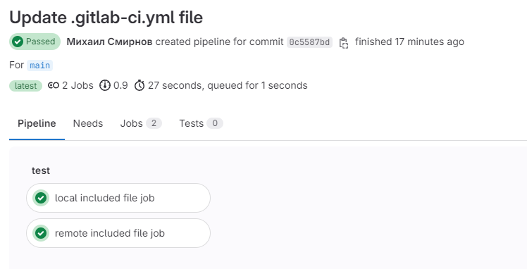

## Домашнее задание по Уроку 4 Troubleshooting (диагностика и решение проблем в CI/CD)

Ссылка на gitlab_ci.yaml: https://gitlab.com/ci-cd7655047/4/-/blob/main/.gitlab-ci.yml

### Задание
__Сделать локальный шаблон CI и отдельный репозиторий с шаблонами, подключить их к своему основному репозиторию через include.__
___
### Решение

Создаем в том же репозитории файл local-included-file.yml с джобой:

    local included file job:
    script:
        - echo "Это код из файла, который включен локально"
  
Создал другой репозиторий (проект) и разместил в нём файл remote-included-file.yml с джобой:

remote included file job:
  script:
    - echo "Это код из файла, который включен из другого репозитория"

 Сделал через инклуд:

include:
  - remote: https://gitlab.com/my_first_project7991847/Ci-Cd-2023/-/blob/main/dz-5/remote-included-file.yml?ref_type=heads
  - local: local-included-file.yml
Отработали обе джобы:

